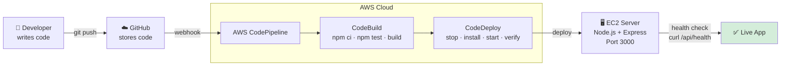
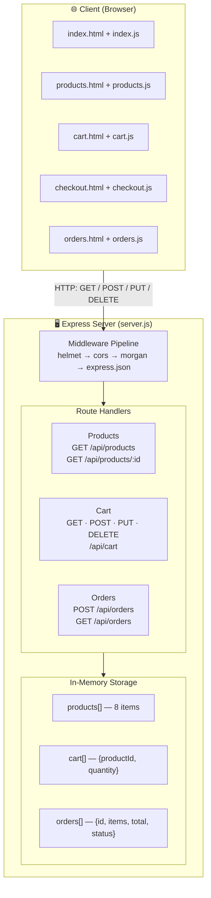
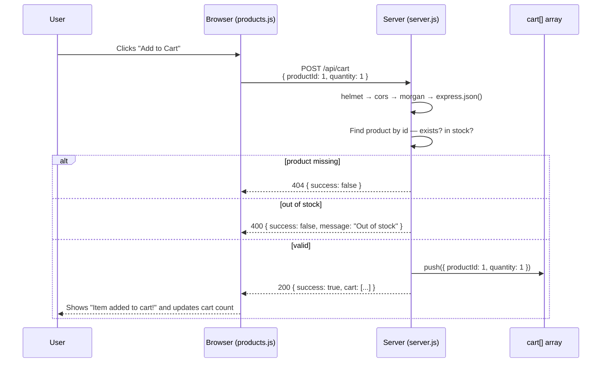
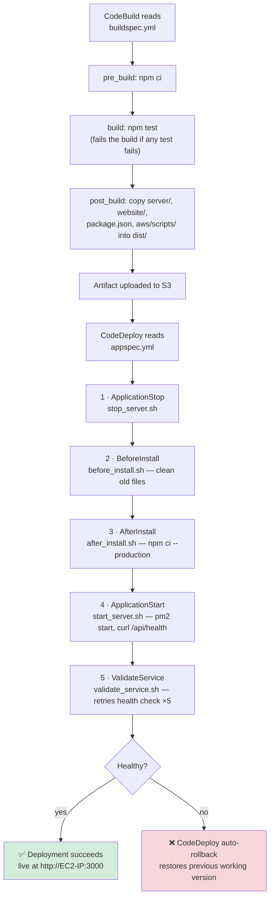

# 🛒 E-Commerce Store — AWS CI/CD Pipeline

A complete e-commerce website with a fully automated CI/CD pipeline for AWS. This project shows how to build, test, and deploy a full-stack web app automatically — push code to GitHub, and it ships itself to a live server.

---

## Table of Contents

- [How It Works](#how-it-works)
- [Features](#features)
- [Project Structure](#project-structure)
- [Quick Start](#quick-start)
- [System Architecture](#system-architecture)
- [Request Lifecycle Example](#request-lifecycle-example-add-to-cart)
- [CI/CD Pipeline](#cicd-pipeline)
- [API Reference](#api-reference)
- [Testing](#testing)
- [Deploy to AWS](#deploy-to-aws)
- [Project Files Summary](#project-files-summary)
- [License](#license)

---

## How It Works



One push to GitHub triggers a chain of automated checks and builds that ends with the app running live on a real AWS server — no manual file copying required.

---

## Features

- **Product Catalog** — browse 8 products across 5 categories
- **Shopping Cart** — add, update, and remove items with quantity controls
- **Checkout** — a simple checkout flow that collects customer details
- **Order Management** — view complete order history
- **Search & Filter** — find products by name or category
- **Responsive Design** — works on desktop, tablet, and mobile
- **Automated Testing** — 18 test cases cover all core functionality
- **Auto Deployment** — push to GitHub, and AWS deploys automatically
- **Auto Rollback** — a failed deployment automatically reverts to the last working version
- **Security** — Helmet.js adds standard security headers to every response
- **Monitoring** — CloudWatch tracks logs, metrics, and alerts
- **Infrastructure as Code** — both CloudFormation and Terraform templates are included

---

## Project Structure

```
aws-cicd-pipeline/
│
├── website/                     ← WHAT USERS SEE (frontend)
│   ├── index.html                 Home page
│   ├── products.html              Product listing page
│   ├── cart.html                  Shopping cart page
│   ├── checkout.html              Checkout page
│   ├── orders.html                Order history page
│   ├── css/
│   │   └── main.css               Styling (colors, layout)
│   └── js/
│       ├── index.js               Home page logic
│       ├── products.js            Product page logic
│       ├── cart.js                Cart page logic
│       ├── checkout.js            Checkout logic
│       └── orders.js              Orders page logic
│
├── server/                      ← BACKEND LOGIC
│   ├── server.js                  API routes and data storage
│   └── tests/
│       └── api.test.js            18 automated tests
│
├── aws/                         ← CLOUD DEPLOYMENT
│   ├── appspec.yml                CodeDeploy instructions
│   ├── buildspec.yml              CodeBuild instructions
│   ├── infrastructure/
│   │   ├── cloudformation.yml     AWS resource template
│   │   ├── main.tf                Terraform alternative
│   │   └── terraform.tfvars       Terraform variables
│   └── scripts/
│       ├── before_install.sh      Clean up before deploy
│       ├── after_install.sh       Install dependencies
│       ├── start_server.sh        Start the application
│       ├── stop_server.sh         Stop the application
│       └── validate_service.sh    Health check
│
├── package.json                 ← Dependencies and scripts
├── package-lock.json            ← Exact dependency versions
├── .env                         ← Environment variables (not committed)
└── .gitignore                   ← Files Git should ignore
```

---

## Quick Start

### 1. Clone and install

```bash
git clone https://github.com/YOUR_USERNAME/aws-cicd-pipeline.git
cd aws-cicd-pipeline
npm install
```

### 2. Run locally

```bash
npm run dev
# open http://localhost:3000
```

### 3. Run tests

```bash
npm test
# 18 tests passing
```

---

## System Architecture



There's no real database — `products`, `cart`, and `orders` are plain JavaScript arrays living in server memory, which is perfect for learning but resets whenever the server restarts.

---

## Request Lifecycle Example: Add to Cart

This is what actually happens, step by step, when someone clicks "Add to Cart":



Placing an order (`POST /api/orders`) follows the same pattern: validate the request, transform `cart[]` into priced `orderItems[]`, calculate the total, save to `orders[]`, clear the cart, and return the new order as JSON.

---

## CI/CD Pipeline

### GitHub Actions (Continuous Integration)

Every push to `main`/`develop`, and every pull request into `main`, runs `.github/workflows/ci.yml`:

1. Check out the code
2. Set up Node.js 18
3. `npm ci` — install exact dependency versions
4. `npm test` — run all 18 tests
5. `npm run lint` — check code style

If any step fails, the commit gets a red ❌ on GitHub and should not be merged or deployed.

### AWS Build & Deploy (Continuous Deployment)



**Automatic rollback:** if `validate_service.sh` exits with a failure code after 5 retries, CodeDeploy marks the deployment failed, restores the last known-good version from S3, re-runs the install hooks with it, and a CloudWatch alarm (`cicd-pipeline-failure-alarm`) notifies the developer. The app is never left in a broken state.

---

## API Reference

### Products

| Method | Endpoint | Description |
|---|---|---|
| GET | `/api/products` | List all products. Supports `?category=` and `?search=` query filters. |
| GET | `/api/products/:id` | Get a single product by ID (404 if not found). |

<details>
<summary>Example: <code>GET /api/products</code> response</summary>

```json
{
  "success": true,
  "count": 8,
  "products": [
    { "id": 1, "name": "Wireless Headphones", "price": 79.99, "image": "🎧", "category": "Electronics", "stock": 50 },
    { "id": 2, "name": "Smart Watch", "price": 199.99, "image": "⌚", "category": "Electronics", "stock": 30 }
  ]
}
```
</details>

### Cart

| Method | Endpoint | Description |
|---|---|---|
| GET | `/api/cart` | View the current cart, including item subtotals and a running total. |
| POST | `/api/cart` | Add an item. Body: `{ "productId": 1, "quantity": 1 }` |
| PUT | `/api/cart/:productId` | Update an item's quantity. Body: `{ "quantity": 5 }` |
| DELETE | `/api/cart/:productId` | Remove a single item from the cart. |
| DELETE | `/api/cart` | Clear the entire cart. |

<details>
<summary>Example: <code>GET /api/cart</code> response</summary>

```json
{
  "success": true,
  "cart": [
    {
      "productId": 1,
      "quantity": 2,
      "product": { "name": "Wireless Headphones", "price": 79.99 },
      "subtotal": 159.98
    }
  ],
  "itemCount": 2,
  "total": "159.98"
}
```
</details>

### Orders

| Method | Endpoint | Description |
|---|---|---|
| POST | `/api/orders` | Create an order from the current cart. Fails with 400 if the cart is empty or fields are missing. |
| GET | `/api/orders` | List all past orders. |

<details>
<summary>Example: <code>POST /api/orders</code> request &amp; response</summary>

```json
// Request body
{
  "customerName": "John Doe",
  "email": "john@email.com",
  "address": "123 Main St"
}
```

```json
// Response (200 OK)
{
  "success": true,
  "message": "Order placed successfully",
  "order": {
    "id": 1,
    "customerName": "John Doe",
    "total": 159.98,
    "status": "confirmed",
    "createdAt": "2026-07-23T10:30:00.000Z"
  }
}
```
</details>

### System

| Method | Endpoint | Description | Example response |
|---|---|---|---|
| GET | `/api/health` | Health check, used by the deploy scripts | `{ "status": "healthy", "uptime": ... }` |
| GET | `/api/info` | Basic app metadata | `{ "app": "...", "features": [...] }` |
| GET | `/api/metrics` | Simple runtime statistics | `{ "totalProducts": 8, "successRate": "..." }` |

---

## Testing

```bash
# Run all tests
npm test

# Run with a coverage report
npm test -- --coverage

# Expected output:
# Test Suites: 1 passed, 1 total
# Tests:       18 passed, 18 total
```

| Test Group | Tests | What They Check |
|---|---|---|
| Products | 4 | List all, get single by ID, 404 for a missing product, filter by category |
| Cart | 6 | View empty cart, add item, reject invalid product, update quantity, remove item, clear cart |
| Orders | 4 | Create order, reject empty cart, reject missing fields, list all orders |
| Health & Info | 4 | Health check, app info, metrics, homepage is served |

---

## Deploy to AWS

### Push to GitHub

```bash
git init
git add .
git commit -m "Initial commit: AWS CI/CD Pipeline"
git remote add origin https://github.com/YOUR_USERNAME/aws-cicd-pipeline.git
git branch -M main
git push -u origin main
```

### Option 1: CloudFormation (recommended)

```bash
aws configure

aws cloudformation deploy \
  --template-file aws/infrastructure/cloudformation.yml \
  --stack-name cicd-pipeline \
  --parameter-overrides \
    GitHubOwner=YOUR_USERNAME \
    GitHubRepo=aws-cicd-pipeline \
    GitHubToken=YOUR_PAT \
    KeyPairName=YOUR_KEY_PAIR \
  --capabilities CAPABILITY_IAM
```

### Option 2: Terraform

```bash
cd aws/infrastructure
# edit terraform.tfvars with your own values first
terraform init
terraform plan
terraform apply
```

---

## Project Files Summary

| File | Location | Purpose |
|---|---|---|
| `server.js` | `server/` | Main backend server with all API routes |
| `api.test.js` | `server/tests/` | 18 automated test cases |
| `index.html` | `website/` | Home page |
| `products.html` | `website/` | Product listing page |
| `cart.html` | `website/` | Shopping cart page |
| `checkout.html` | `website/` | Checkout page |
| `orders.html` | `website/` | Order history page |
| `main.css` | `website/css/` | All styling for the website |
| `index.js` | `website/js/` | Home page JavaScript |
| `products.js` | `website/js/` | Products page JavaScript |
| `cart.js` | `website/js/` | Cart page JavaScript |
| `checkout.js` | `website/js/` | Checkout page JavaScript |
| `orders.js` | `website/js/` | Orders page JavaScript |
| `appspec.yml` | `aws/` | CodeDeploy configuration |
| `buildspec.yml` | `aws/` | CodeBuild configuration |
| `cloudformation.yml` | `aws/infrastructure/` | AWS CloudFormation template |
| `main.tf` | `aws/infrastructure/` | Terraform configuration |
| `before_install.sh` | `aws/scripts/` | Pre-deployment cleanup |
| `after_install.sh` | `aws/scripts/` | Dependency installation |
| `start_server.sh` | `aws/scripts/` | Application startup |
| `stop_server.sh` | `aws/scripts/` | Application shutdown |
| `validate_service.sh` | `aws/scripts/` | Health check validation |
| `package.json` | root | Node.js project configuration |

---

## License

MIT License — see [LICENSE](LICENSE) for details.